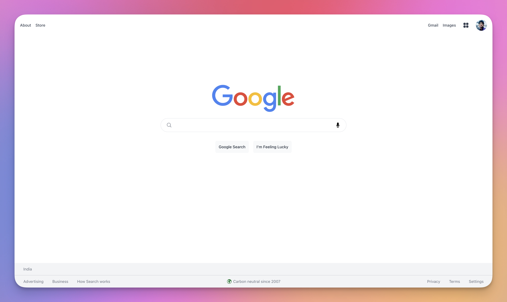
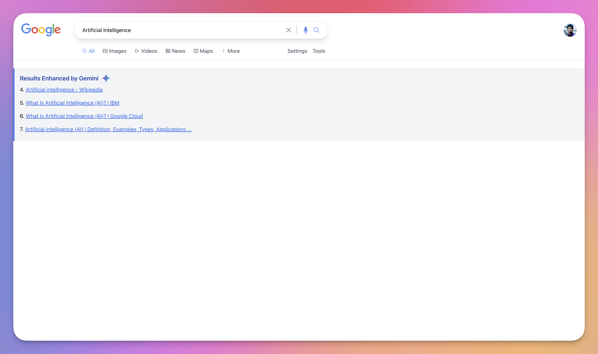

#  2.0

Google 2.0 is a modern, AI-powered clone of Google Search, enhanced with Gemini AI. It replicates the familiar Google search experience but improves search result relevance by leveraging Gemini to filter and prioritize results based on user intent and context.

Built with Next.js and React, this project includes a responsive UI, a custom search form, and smart result processing. It also integrates a pagination system to handle large search results efficiently. Explore the power of AI-driven search with this innovative Google clone!

Link

---

## 📸 Screenshots




---

## ✨ Features

- Google Search Clone: A clean and responsive interface replicating the core functionality of Google Search.
- Gemini AI Integration: Enhanced search results with Gemini AI, filtering and prioritizing results based on user intent and context.
- Search Results Display: Results are displayed with clickable titles and serial numbers for better navigation and clarity.
- Smart Result Processing: Uses Gemini AI to improve search relevance by analyzing and filtering Google search results.
- Custom Search Bar: A functional search bar that redirects users to search results with ease.
- Responsive Design: Fully optimized for mobile and desktop views, ensuring a seamless experience across devices.
- Error Handling: Displays user-friendly error messages in case of processing issues or failed searches.
- Loading State: Displays a loading message while search results are being enhanced by Gemini AI.
- Pagination System: Efficient pagination for large sets of search results, providing a smooth navigation experience.
- Simple and Clean UI: Minimalistic design with easy-to-use interface elements like the search bar, buttons, and footer.

---

## 🔧 Installation

1. Clone this repository:
   ```bash
   git clone https://github.com/anshusinha26/Google-2.0.git

2. Navigate to the project directory:
   ```bash
   cd google-2.0
   
3. Install the dependencies:
   ```bash
   yarn install

4. Set up the necessary API keys:

- Obtain a Google Custom Search API key and a Gemini API key.
- Create a .env file in the root directory and add the following lines, replacing the placeholders with your actual API keys:
  ```bash
  GOOGLE_SEARCH_API_KEY=Input_your_key
  GOOGLE_SEARCH_CONTEXT_KEY=Input_your_key
  GOOGLE_GEMINI_API_KEY=Input_your_key

5. Start the development server:
   ```bash
   yarn dev

---

## ⚙️ Tech Stack

- JavaScript: The primary programming language used for the project.
- Node.js: A JavaScript runtime environment used for server-side development.
- React: A JavaScript library for building user interfaces.
- Next.js: A React framework for building server-rendered applications.
- Yarn: A package manager for JavaScript used to manage project dependencies.
- Google Custom Search API: The API used to fetch search results from Google.
- Gemini API: The API used to process and enhance the search results.
